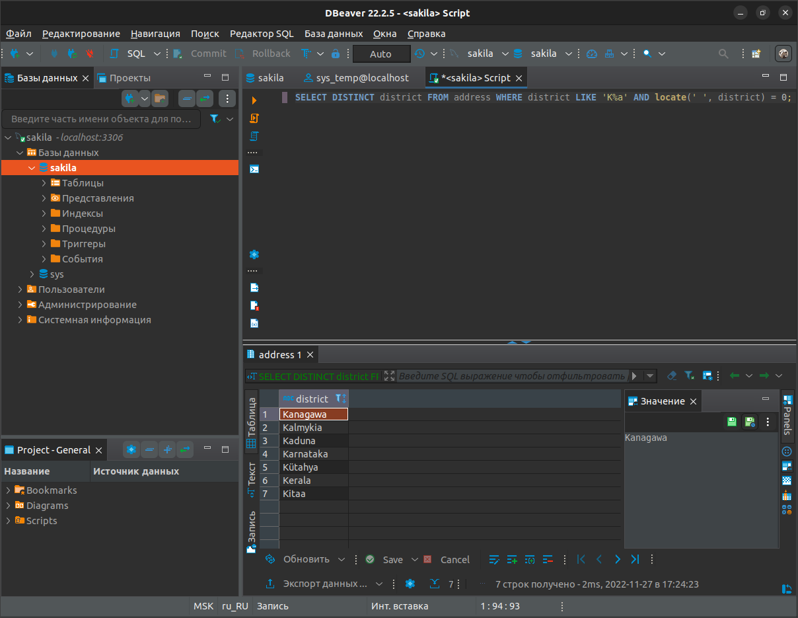
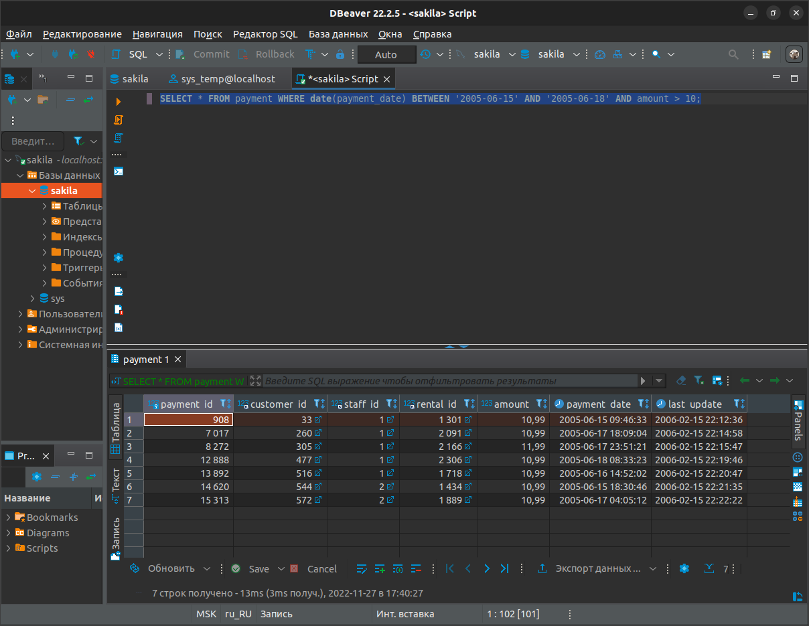
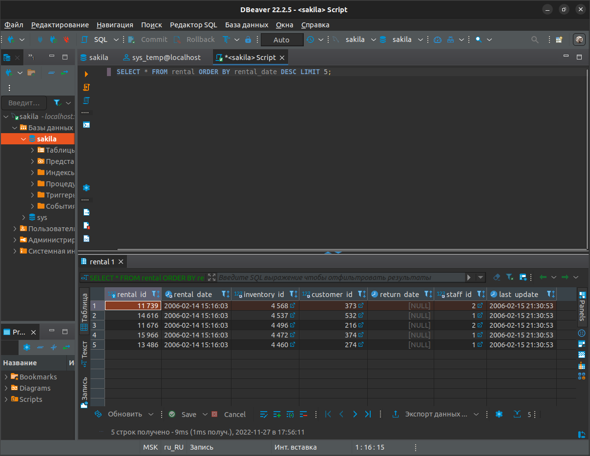
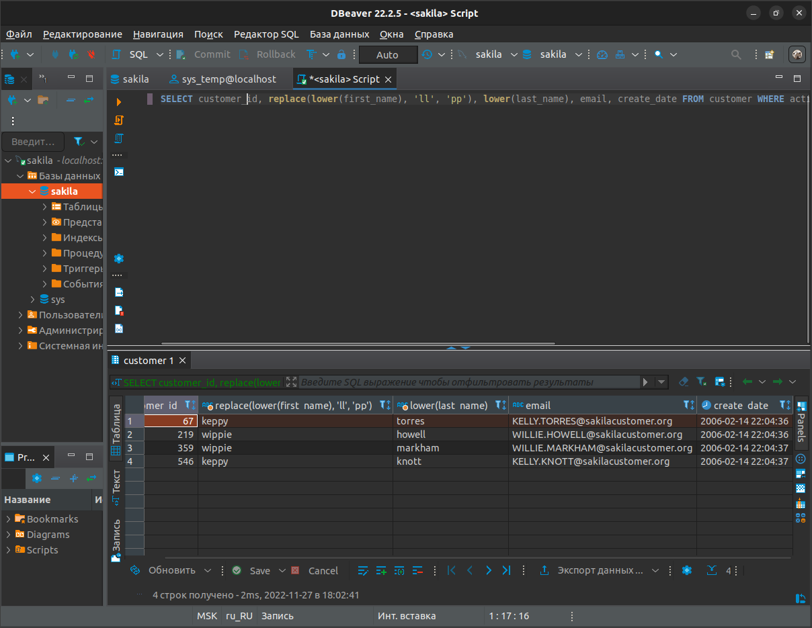

# 12.3-__Andreev_Denis

---

## Задание 1.

### Получите уникальные названия районов из таблицы с адресами, которые начинаются на “K” и заканчиваются на “a”, и не содержат пробелов.

```
mysql> SELECT DISTINCT district FROM address WHERE district LIKE 'K%a' AND locate(' ', district) = 0;
+-----------+
| district  |
+-----------+
| Kanagawa  |
| Kalmykia  |
| Kaduna    |
| Karnataka |
| Kütahya   |
| Kerala    |
| Kitaa     |
+-----------+
7 rows in set (0,00 sec)
```



---

## Задание 2

### Получите из таблицы платежей за прокат фильмов информацию по платежам, которые выполнялись в промежуток с 15 июня 2005 года по 18 июня 2005 года включительно, и стоимость которых превышает 10.00.

```
mysql> SELECT * FROM payment WHERE date(payment_date) BETWEEN '2005-06-15' AND '2005-06-18' AND amount > 10;
+------------+-------------+----------+-----------+--------+---------------------+---------------------+
| payment_id | customer_id | staff_id | rental_id | amount | payment_date        | last_update         |
+------------+-------------+----------+-----------+--------+---------------------+---------------------+
|        908 |          33 |        1 |      1301 |  10.99 | 2005-06-15 09:46:33 | 2006-02-15 22:12:36 |
|       7017 |         260 |        1 |      2091 |  10.99 | 2005-06-17 18:09:04 | 2006-02-15 22:14:58 |
|       8272 |         305 |        1 |      2166 |  11.99 | 2005-06-17 23:51:21 | 2006-02-15 22:15:47 |
|      12888 |         477 |        1 |      2306 |  10.99 | 2005-06-18 08:33:23 | 2006-02-15 22:19:46 |
|      13892 |         516 |        1 |      1718 |  10.99 | 2005-06-16 14:52:02 | 2006-02-15 22:20:47 |
|      14620 |         544 |        2 |      1434 |  10.99 | 2005-06-15 18:30:46 | 2006-02-15 22:21:35 |
|      15313 |         572 |        2 |      1889 |  10.99 | 2005-06-17 04:05:12 | 2006-02-15 22:22:22 |
+------------+-------------+----------+-----------+--------+---------------------+---------------------+
7 rows in set (0,02 sec)
```



---

## Задание 3

### Получите последние 5 аренд фильмов. 

```
mysql> SELECT * FROM rental ORDER BY rental_date DESC LIMIT 5;
+-----------+---------------------+--------------+-------------+-------------+----------+---------------------+
| rental_id | rental_date         | inventory_id | customer_id | return_date | staff_id | last_update         |
+-----------+---------------------+--------------+-------------+-------------+----------+---------------------+
|     11739 | 2006-02-14 15:16:03 |         4568 |         373 | NULL        |        2 | 2006-02-15 21:30:53 |
|     14616 | 2006-02-14 15:16:03 |         4537 |         532 | NULL        |        1 | 2006-02-15 21:30:53 |
|     11676 | 2006-02-14 15:16:03 |         4496 |         216 | NULL        |        2 | 2006-02-15 21:30:53 |
|     15966 | 2006-02-14 15:16:03 |         4472 |         374 | NULL        |        1 | 2006-02-15 21:30:53 |
|     13486 | 2006-02-14 15:16:03 |         4460 |         274 | NULL        |        1 | 2006-02-15 21:30:53 |
+-----------+---------------------+--------------+-------------+-------------+----------+---------------------+
5 rows in set (0,00 sec)
```



---

## Задание 4

### Одним запросом получите активных покупателей, имена которых Kelly или Willie.

### Сформируйте вывод в результат таким образом:

1. `Все буквы в фамилии и имени из верхнего регистра переведите в нижний регистр,`
2. `Замените буквы 'll' в именах на 'pp'`

```
mysql> SELECT customer_id, replace(lower(first_name), 'll', 'pp'), lower(last_name), email, create_date FROM customer WHERE active = '1' AND first_name = 'Kelly' OR active = '1' AND first_name = 'Willie';
+-------------+----------------------------------------+------------------+-----------------------------------+---------------------+
| customer_id | replace(lower(first_name), 'll', 'pp') | lower(last_name) | email                             | create_date         |
+-------------+----------------------------------------+------------------+-----------------------------------+---------------------+
|          67 | keppy                                  | torres           | KELLY.TORRES@sakilacustomer.org   | 2006-02-14 22:04:36 |
|         219 | wippie                                 | howell           | WILLIE.HOWELL@sakilacustomer.org  | 2006-02-14 22:04:36 |
|         359 | wippie                                 | markham          | WILLIE.MARKHAM@sakilacustomer.org | 2006-02-14 22:04:37 |
|         546 | keppy                                  | knott            | KELLY.KNOTT@sakilacustomer.org    | 2006-02-14 22:04:37 |
+-------------+----------------------------------------+------------------+-----------------------------------+---------------------+
4 rows in set (0,00 sec)
```



---

